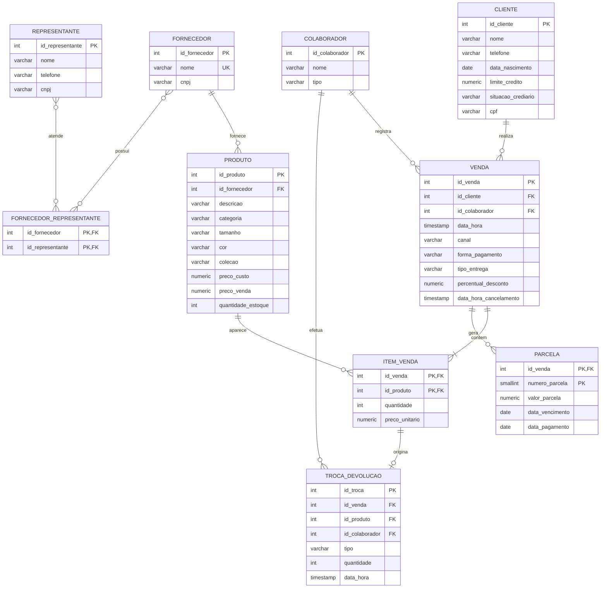

# DER lógico atualizado

Este diagrama representa a passagem do DER conceitual para as relações
implementadas. As tabelas associativas e as chaves compostas aparecem
explicitamente.

```mermaid
erDiagram
    CLIENTE ||--o{ VENDA : realiza
    COLABORADOR ||--o{ VENDA : registra
    FORNECEDOR ||--o{ PRODUTO : fornece
    FORNECEDOR o{--o{ FORNECEDOR_REPRESENTANTE : possui
    REPRESENTANTE o{--o{ FORNECEDOR_REPRESENTANTE : atende
    VENDA ||--|{ ITEM_VENDA : contem
    PRODUTO ||--o{ ITEM_VENDA : aparece
    VENDA ||--o{ PARCELA : gera
    ITEM_VENDA ||--o| TROCA_DEVOLUCAO : origina
    COLABORADOR ||--o{ TROCA_DEVOLUCAO : efetua

    CLIENTE {
        int id_cliente PK
        varchar nome
        varchar telefone
        date data_nascimento
        numeric limite_credito
        varchar situacao_crediario
        varchar cpf
    }
    COLABORADOR {
        int id_colaborador PK
        varchar nome
        varchar tipo
    }
    FORNECEDOR {
        int id_fornecedor PK
        varchar nome UK
        varchar cnpj
    }
    REPRESENTANTE {
        int id_representante PK
        varchar nome
        varchar telefone
        varchar cnpj
    }
    FORNECEDOR_REPRESENTANTE {
        int id_fornecedor PK, FK
        int id_representante PK, FK
    }
    PRODUTO {
        int id_produto PK
        int id_fornecedor FK
        varchar descricao
        varchar categoria
        varchar tamanho
        varchar cor
        varchar colecao
        numeric preco_custo
        numeric preco_venda
        int quantidade_estoque
    }
    VENDA {
        int id_venda PK
        int id_cliente FK
        int id_colaborador FK
        timestamp data_hora
        varchar canal
        varchar forma_pagamento
        varchar tipo_entrega
        numeric percentual_desconto
        timestamp data_hora_cancelamento
    }
    ITEM_VENDA {
        int id_venda PK, FK
        int id_produto PK, FK
        int quantidade
        numeric preco_unitario
    }
    PARCELA {
        int id_venda PK, FK
        smallint numero_parcela PK
        numeric valor_parcela
        date data_vencimento
        date data_pagamento
    }
    TROCA_DEVOLUCAO {
        int id_troca PK
        int id_venda FK
        int id_produto FK
        int id_colaborador FK
        varchar tipo
        int quantidade
        timestamp data_hora
    }
```

